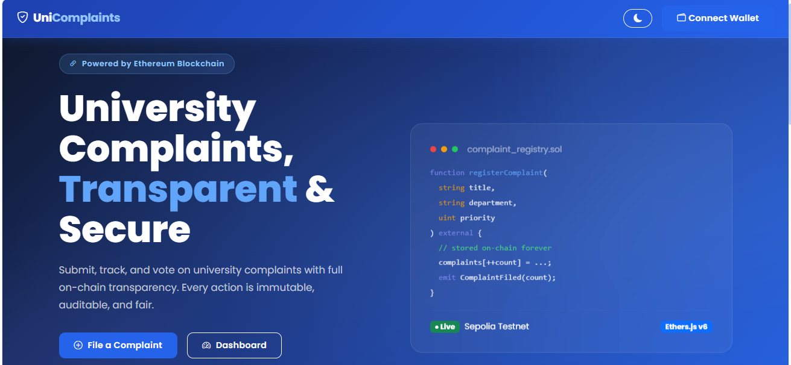
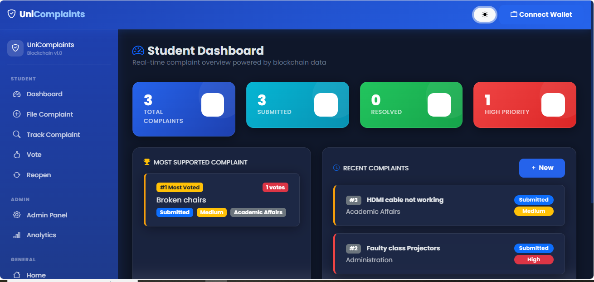
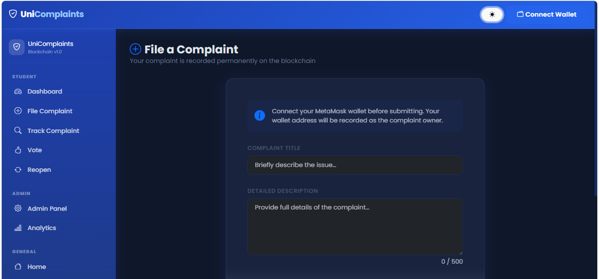
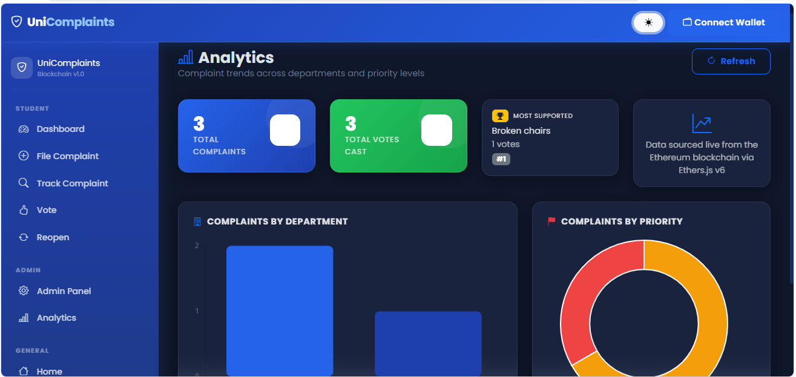

# UniComplaints — Decentralized University Complaint Management System

A blockchain-based complaint management platform that enables students to submit, track, vote on, and monitor university complaints with transparency and immutability through Ethereum smart contracts.

## Features

* Submit complaints securely on the blockchain
* Track complaint status in real time
* Community voting system for prioritizing complaints
* Complaint reopening workflow
* Administrative complaint management
* Analytics dashboard for complaint insights
* MetaMask wallet integration
* Ethereum Sepolia Testnet deployment

## Screenshots

Add screenshots here:

### Landing Page



### Dashboard



### Complaint Submission



### Analytics



## Technology Stack

### Frontend

* HTML5
* CSS3
* JavaScript (ES6)
* Bootstrap 5.3
* Bootstrap Icons

### Blockchain

* Solidity
* Ethereum
* MetaMask
* Ethers.js v6

### Data Visualization

* Chart.js v4

## Project Structure

```text
UniComplaints/
├── index.html
├── dashboard.html
├── register.html
├── track.html
├── vote.html
├── reopen.html
├── admin.html
├── analytics.html
├── css/
├── js/
├── contracts/
│   ├── abi.js
│   └── UniversityComplaintSystem.sol
└── assets/
```

## Setup

1. Replace the contract address in `js/contract.js`.
2. Connect MetaMask to the Sepolia Test Network.
3. Open `index.html` or deploy to Netlify.

## Deployment

Live Demo: [Add Netlify URL]

Contract Address: [Add Sepolia Contract Address]

## Key Learning Outcomes

* Smart Contract Development using Solidity
* Web3 Wallet Integration
* Ethereum Testnet Deployment
* Decentralized Application (DApp) Architecture
* Frontend–Blockchain Communication using Ethers.js

## Author

Malik Usman Ali
